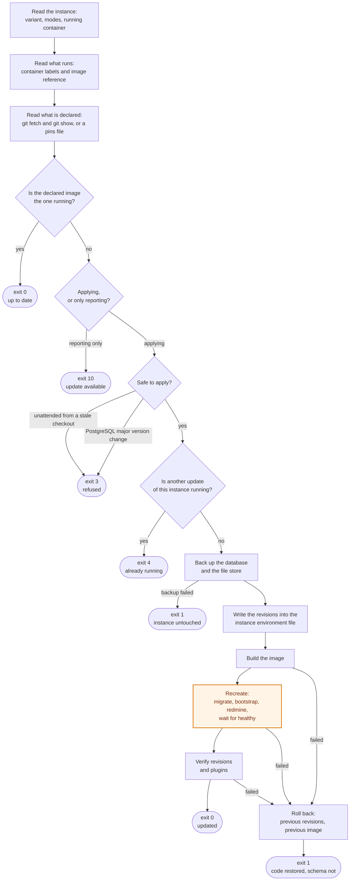

# How an instance is updated

The version of an instance is the image its `redmine` container runs, and that
image tag names the plugin revisions built into it. `scripts/update-instance.sh`
moves one instance from the version it runs to the version this deployment
declares. This document describes what it does in the order it does it, what
each step touches, and what a failure can cost.

The command itself, its options and how to schedule it are in the README.

## The sequence

The highlighted step is the only irreversible one. Everything before it can be
undone by putting the previous values back; everything it does to the database
can only be undone from a backup.

1. **Read the instance.** Variant, database mode and update mode come from its
   environment file through the same resolution the other scripts use, so a
   shell variable that contradicts the file is an error rather than a silent
   choice. The `redmine` container must be running; otherwise the script stops
   without doing anything.
2. **Read what runs.** The revisions come from the labels of the running
   container and not from any configuration file, because an environment file
   can already name a version that has not been built or activated yet.
3. **Read what is declared.** `git fetch` followed by `git show REF:<file>`, or
   a pins file when one is given. The fetch only moves remote-tracking refs: no
   file of the checkout, no branch and no submodule pointer is modified.
4. **Compare and decide.** Identical image references mean there is nothing to
   do. Otherwise the script reports the difference and decides whether it may
   apply it, which depends on `--check`, on the update mode, on whether the
   checkout still matches the declared reference and on whether PostgreSQL
   would change major version.
5. **Take the lock**, so that a scheduled update and a manual one cannot run
   against the same Compose project at the same time.
6. **Back up.** `scripts/backup.sh` dumps the database, archives the Redmine
   file store and writes a manifest and its checksums into a timestamped
   directory, which is assembled under a temporary name and renamed at the end,
   so a half-written backup never looks like a complete one. If the backup
   fails, the update stops here and the instance has not been touched.
7. **Write the revisions** into the instance environment file, after copying it
   aside. The rewrite goes through a temporary file and is then poured into the
   original one, which keeps its permissions and its inode.
8. **Build the image** with the new revisions, verifying inside the build that
   each plugin checkout is exactly the pinned commit. The running instance is
   not touched by this step.
9. **Recreate.** Compose waits for the database to be healthy, runs `migrate`
   to completion, then `bootstrap`, and only then starts the new `redmine` and
   waits for it to become healthy.
10. **Verify** that the new container carries the revisions that were asked for
    and that it registers the plugins the variant expects.

## What each step touches

| Step | Database | File store | Instance environment file | Running container |
| --- | --- | --- | --- | --- |
| Read and decide | no | no | no | no |
| Backup | reads | reads | no | no |
| Write revisions | no | no | rewritten | no |
| Build | no | no | no | no |
| Recreate | **migrated** | no | no | replaced |
| Verify | reads | no | no | no |

Named volumes survive a recreation. The script never runs `down`, never passes
`--volumes`, never removes an image and never prunes anything, so the previous
image is still on the host after an update and is what a rollback starts again.

## The point of no return

It is the `migrate` service of step 9, which runs `db:migrate`,
`redmine:load_default_data` and `redmine:plugins:migrate` against the live
database. Plugin migrations are not reversible in general: the validation of
the 0.1.0 to 0.1.1 upgrade asserts precisely that columns of the old schema are
gone afterwards.

Before that service completes, a failure costs nothing: the previous revisions
go back into the environment file and the previous image is started again.
After it completes, the code can be put back but the schema cannot, and the
previous code may not understand the new schema.

## What can be lost

**Nothing is deleted by an update.** The risks are these four, in the order
they matter.

**A migration that stops halfway.** PostgreSQL runs each migration in its own
transaction, so a failing migration is rolled back, but the migrations that
already succeeded in the same run stay applied. The instance is then on an
intermediate schema, the script starts the previous image again, and that image
may not work against it. No data has been lost, but the instance can be
unusable until it is restored.

**A restore loses whatever was written after the backup.** `scripts/restore.sh`
puts the database and the file store back as the backup had them. During an
update that window is the few minutes between step 6 and the decision to go
back, and the instance is down for part of it, but it is a real loss and it is
a deliberate decision: the update never restores the database by itself.

**A jump across several releases** runs more migrations at once, and only the
0.1.0 to 0.1.1 path has a validation of its own. Updating in steps is safer
than updating across a year of releases in one go.

**The backup does not contain the instance environment file.** It holds the
database, the file store and a manifest, but not the secrets of the instance.
Losing `REDMINE_SECRET_KEY_BASE` invalidates sessions rather than data, and
`POSTGRES_PASSWORD` can be set again on the database server, but those files
deserve their own backup.

Two things that are not data loss but are worth knowing: the instance is out of
service from the recreation until it is healthy again, and nothing is written
during that time because the application is down; and on a shared PostgreSQL
server an update only ever touches the database of its own instance, as does a
restore, which removes only the objects owned by that instance role.

## Going back

An update that fails after step 7 restores the previous revisions and starts
the previous image, and then says what that does and does not undo. If the
migration had already run, the way back is the backup that the same update took
in step 6, and the script prints the exact `restore.sh` command for it. The
copy of the environment file it made in step 7 is kept as well, and the script
prints where.

## One update at a time

Each instance is locked while it is being updated, through a directory named
after its Compose project under `TMPDIR` or `/tmp`, which
`COSMOSYS_UPDATE_LOCK_DIR` moves elsewhere. A second update of the same
instance stops with status 4 instead of running a second recreation against the
same project; instances on one host still update in parallel with each other.
Reporting with `--check` does not take the lock, because it changes nothing.

A lock left behind by a killed update has to be removed by hand, which is
deliberate: the file names the process that took it, and removing it while an
update is genuinely running is worse than waiting.
